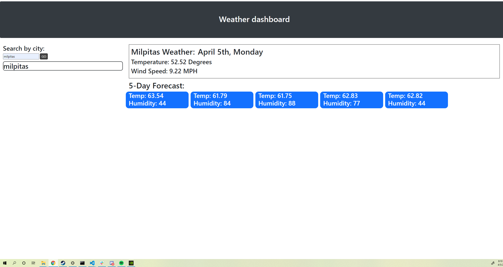

# Weather-Report

## summary of assignment
- we were tasked with making an interactive page which takes in the name of a town and returns weather data using APIs.

## Languages used
-HTML was used to build the layout. I used Bootstrap for most of the styling.
-CSS was used to add style to a few specific IDs and classes
-Javascript was used to fetch APIs, which were used to retrieve weather data

## preview of the site



## code snippet
```javascript


    fetch(forcastApiURL)
    .then(function (response) {
        console.log(forcastApiURL);
        
        response.json().then(function (data) {
            console.log(data); 

        $(".day-1").html("<h2>" + "Temp: " + data.list[4].main.temp + " Humidity: " + data.list[4].main.humidity)
        $(".day-2").html("<h2>" + "Temp: " + data.list[12].main.temp + " Humidity: " + data.list[1].main.humidity)
        $(".day-3").html("<h2>" + "Temp: " + data.list[20].main.temp + " Humidity: " + data.list[2].main.humidity)
        $(".day-4").html("<h2>" + "Temp: " + data.list[28].main.temp + " Humidity: " + data.list[3].main.humidity)
        $(".day-5").html("<h2>" + "Temp: " + data.list[36].main.temp + " Humidity: " + data.list[4].main.humidity)
        
    })
        
```

## my links
[Github](https://github.com/SerenaChandler),
[Linkedin](https://www.linkedin.com/in/serena-chandler-b62a39204/),
[daily planner](https://serenachandler.github.io/DailyPlanner/)